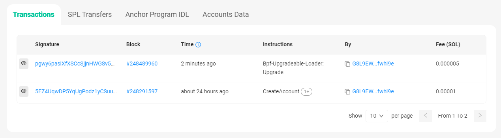

# Solana入门知识

### Solana简介

Solana是一个高性能的区块链平台，是一种快速、安全且可扩展的区块链基础设施。

Solana的核心特征包括：

- 共识机制：Proof of History (PoH)。PoH是一种时间证明机制，它能够为网络上的事件创建一个历史记录，使得节点能够在不必互相通信的情况下验证事件的顺序和时间。

- 共识算法：Tower BFT。这是一种优化后的PBFT（实用拜占庭容错）共识算法，它使用PoH作为加密时钟来减少消息传递的开销，从而提高网络吞吐量。

- 高吞吐量：具备高性能，其理论上的交易处理速度可以达到每秒数十万笔。

- 低交易费用：交易费用较低，进行小额交易变得更加经济实惠。

- 高度可扩展性：由于其独特的共识机制和架构，可在不牺牲去中心化或安全性的前提下扩展网络容量。
  
---
### 账户模型

[Solana账户模型介绍](./docs/Solana账户模型介绍.md)

---
### 环境搭建

[Solana开发环境搭建](./docs/Solana开发环境搭建.md)

---
### 基本操作

#### 设置网络

Solana 的集群有本地集群（localhost）和公开集群。

公开集群又分为：
- 开发者网络（devnet），RPC地址：https://api.devnet.solana.com
- 测试网（testnet），RPC地址：https://api.testnet.solana.com
- 主网（mainnet-beta），RPC地址：https://api.mainnet-beta.solana.com

设置命令：
```shell
//本地网络
solana config set --url localhost
solana-test-validator

//开发者网
solana config set --url https://api.devnet.solana.com

//测试网
solana config set --url https://api.testnet.solana.com

//主网
solana config set --url https://api.mainnet-beta.solana.com

//设置测试网
> solana config set --url https://api.testnet.solana.com

Config File: /root/.config/solana/cli/config.yml
RPC URL: https://api.testnet.solana.com
WebSocket URL: wss://api.testnet.solana.com/ (computed)
Keypair Path: /root/.config/solana/id.json
Commitment: confirmed
```

#### 创建钱包账户

可以设置一个 BIP39 规范的密码，此密码用来增强助记词的安全性，也可以为空。
```shell
> solana-keygen new

Generating a new keypair

For added security, enter a BIP39 passphrase

NOTE! This passphrase improves security of the recovery seed phrase NOT the
keypair file itself, which is stored as insecure plain text

BIP39 Passphrase (empty for none):

Wrote new keypair to /root/.config/solana/id.json
=================================================================================
pubkey: G8L9EWdphFMdp6618tFfhuUfvP5x1BPZ25UW3wfwhi9e
=================================================================================
Save this seed phrase and your BIP39 passphrase to recover your new keypair:
popular mimic addict alcohol dawn enrich author base useless hollow brush balcony
=================================================================================
```

查看账户公钥。
```shell
> solana-keygen pubkey
G8L9EWdphFMdp6618tFfhuUfvP5x1BPZ25UW3wfwhi9e
```

查看账户余额，新账户余额为0。
```shell
> solana balance
0 SOL
```

申请空投。
```shell
> solana airdrop 1
Requesting airdrop of 1 SOL

Signature: 2f5VW9eQoc1Nj1YbKKjFTKNSJmX6VJPNfqdLurxx5Lf13hKLYQJksCyshr8yi7RDjryLwRfXspCJorqSscaxe5NQ

1 SOL

//再次查看余额
> solana balance
1 SOL
```

---
### 交互实践
以官方HelloWorld演示项目为例。

项目地址：https://github.com/solana-labs/example-helloworld.git

1. 克隆代码
```shell
git clone https://github.com/solana-labs/example-helloworld.git
```

2. 编译代码

```shell
> cd example-helloworld/src/program-rust/
> cargo build-bpf  （或 cargo build-sbf）
```

> 注意：`cargo build`用于编译普通的RUST应用程序，`cargo build-bpf`用于编译solana链上的应用程序。

3. 设置网络
```shell
> solana config set --url https://api.testnet.solana.com

Config File: /root/.config/solana/cli/config.yml
RPC URL: https://api.testnet.solana.com
WebSocket URL: wss://api.testnet.solana.com/ (computed)
Keypair Path: /root/.config/solana/id.json
Commitment: confirmed
```

4. 部署程序

链上程序部署成功返回 Program Id，类似以太坊智能合约地址。
```shell
> solana program deploy target/deploy/helloworld.so
Program Id: ECToMXPsqKV9b6tYiFTwkZcX7y6dwuLXkPyGhbUwH8S
```

5. 升级程序

solana部署的程序，如果`Upgradeable` 字段为Yes，则可以由所有者升级。

官方的helloworld演示项目不支持创建PDA账户，下面将程序升级为支持创建PDA账户的程序。

```
第1步：修改程序代码。

第2步：重新编译代码。
cargo build-bpf

第3步：在区块浏览器确认原程序是否可升级。
solana program show <PROGRAM_ID>

> solana program show ECToMXPsqKV9b6tYiFTwkZcX7y6dwuLXkPyGhbUwH8S

Program Id: ECToMXPsqKV9b6tYiFTwkZcX7y6dwuLXkPyGhbUwH8S
Owner: BPFLoaderUpgradeab1e11111111111111111111111
ProgramData Address: HFkZ51imH5YFEYAoJs9efdD8AG8qsPHka4FSErBXg7Nm
Authority: G8L9EWdphFMdp6618tFfhuUfvP5x1BPZ25UW3wfwhi9e
Last Deployed In Slot: 248291597
Data Length: 91232 (0x16460) bytes
Balance: 0.6361788 SOL

第4步：升级程序。
solana program deploy --program-id <UPGRADEABLE_PROGRAM_ID> /path/to/your_program.so

> solana program deploy --program-id ECToMXPsqKV9b6tYiFTwkZcX7y6dwuLXkPyGhbUwH8S ./target/deploy/helloworldpda.so
Program Id: ECToMXPsqKV9b6tYiFTwkZcX7y6dwuLXkPyGhbUwH8S
```

升级成功后，程序账户地址不变。在区块浏览器可以查看，新增了一条升级交易记录。
https://solscan.io/account/ECToMXPsqKV9b6tYiFTwkZcX7y6dwuLXkPyGhbUwH8S?cluster=testnet



### 附录参考

Solana区块浏览器：https://solscan.io/

Solana区块浏览器：https://explorer.solana.com/