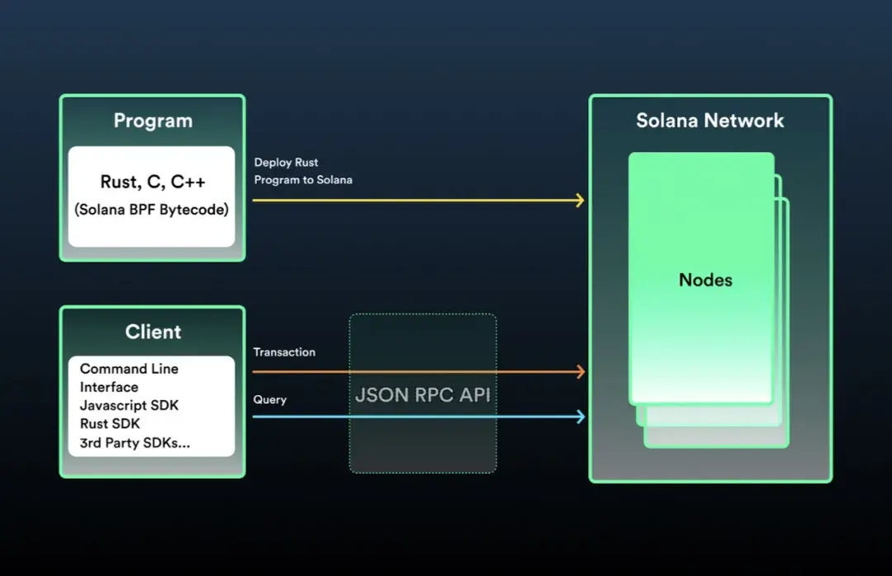

# Solana入门知识

### Solana简介

Solana是一个高性能的区块链平台，是一种快速、安全且可扩展的区块链基础设施。

Solana的核心特征包括：

- 共识机制：Proof of History (PoH)。PoH是一种时间证明机制，它能够为网络上的事件创建一个历史记录，使得节点能够在不必互相通信的情况下验证事件的顺序和时间。

- 共识算法：Tower BFT。这是一种优化后的PBFT（实用拜占庭容错）共识算法，它使用PoH作为加密时钟来减少消息传递的开销，从而提高网络吞吐量。

- 高吞吐量：具备高性能，其理论上的交易处理速度可以达到每秒数十万笔。

- 低交易费用：交易费用较低，进行小额交易变得更加经济实惠。

- 高度可扩展性：由于其独特的共识机制和架构，可在不牺牲去中心化或安全性的前提下扩展网络容量。
  
---
### 账户模型

[Solana账户模型介绍](./docs/Solana账户模型介绍.md)

---
### 环境搭建

[Solana开发环境搭建](./docs/Solana开发环境搭建.md)

---
### 基本操作

[Solana基本操作命令](./docs/Solana基本操作命令.md)

---
### 合约交互

[Solana合约交互方法](./docs/Solana合约交互方法.md)

---
### Rust基础

[Rust基础知识介绍](./docs/Rust基础知识介绍.md)

### 合约开发

[Solana合约开发入门](./docs/Solana合约开发入门.md)

[Anchor框架开发入门](./docs/Anchor框架开发入门.md)

``````
``````
``````
``````
``````
``````
``````
``````
``````
``````




### 附录参考

Solana区块浏览器：https://solscan.io/

Solana区块浏览器：https://explorer.solana.com/

Solana中文开发教程：https://www.solanazh.com/

Solana官方文档：https://solana.com/zh/docs

Rust语言圣经：https://course.rs/basic/intro.html

Rust语言实战：https://practice-zh.course.rs/why-exercise.html

Rust在线运行：https://play.rust-lang.org/

Rust指导文档：https://doc.rust-lang.org/book/title-page.html

Cargo指导文档：https://doc.rust-lang.org/cargo/

Playground：https://beta.solpg.io/

anchor官网：https://www.anchor-lang.com/

anchor框架：https://book.anchor-lang.com/

指南：用Anchor构建Solana程序：https://mp.weixin.qq.com/s/sY2dqn4odQ54CyM-TOx4Yw

Rust中文文档: https://rustwiki.org/docs/