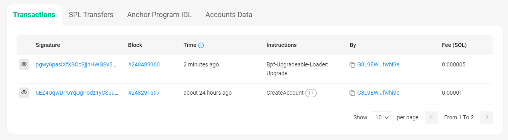

# Solana基本操作命令

---
### 设置网络

Solana 的集群有本地集群（localhost）和公开集群。

公开集群又分为：
- 开发者网络（devnet），RPC地址：https://api.devnet.solana.com
- 测试网（testnet），RPC地址：https://api.testnet.solana.com
- 主网（mainnet-beta），RPC地址：https://api.mainnet-beta.solana.com

设置命令：
```shell
//本地网络
solana config set --url localhost
solana-test-validator

//开发者网
solana config set --url https://api.devnet.solana.com

//测试网
solana config set --url https://api.testnet.solana.com

//主网
solana config set --url https://api.mainnet-beta.solana.com

//设置开发网 (Solana训练营使用开发网)
> solana config set --url https://api.devnet.solana.com

Config File: /root/.config/solana/cli/config.yml
RPC URL: https://api.devnet.solana.com
WebSocket URL: wss://api.devnet.solana.com/ (computed)
Keypair Path: /root/.config/solana/id.json
Commitment: confirmed

//设置测试网
> solana config set --url https://api.testnet.solana.com

Config File: /root/.config/solana/cli/config.yml
RPC URL: https://api.testnet.solana.com
WebSocket URL: wss://api.testnet.solana.com/ (computed)
Keypair Path: /root/.config/solana/id.json
Commitment: confirmed
```

---
### 创建钱包账户

创建钱包账户，可以设置一个 BIP39 规范的密码，此密码用来增强助记词的安全性，也可以为空。
```shell
> solana-keygen new

Generating a new keypair

For added security, enter a BIP39 passphrase

NOTE! This passphrase improves security of the recovery seed phrase NOT the
keypair file itself, which is stored as insecure plain text

BIP39 Passphrase (empty for none):

Wrote new keypair to /root/.config/solana/id.json
=================================================================================
pubkey: G8L9EWdphFMdp6618tFfhuUfvP5x1BPZ25UW3wfwhi9e
=================================================================================
Save this seed phrase and your BIP39 passphrase to recover your new keypair:
=================================================================================
```

导入钱包账户，私钥文件路径：/root/.config/solana/id.json
```
> solana config set --keypair /root/.config/solana/id.json

Config File: /root/.config/solana/cli/config.yml
RPC URL: https://api.devnet.solana.com
WebSocket URL: wss://api.devnet.solana.com/ (computed)
Keypair Path: /root/.config/solana/id.json
Commitment: confirmed
```

查看账户公钥。
```shell
> solana-keygen pubkey
G8L9EWdphFMdp6618tFfhuUfvP5x1BPZ25UW3wfwhi9e
```

查看账户余额，新账户余额为0。
```shell
> solana balance
0 SOL
```

申请空投。
```shell
> solana airdrop 1
Requesting airdrop of 1 SOL

Signature: 2f5VW9eQoc1Nj1YbKKjFTKNSJmX6VJPNfqdLurxx5Lf13hKLYQJksCyshr8yi7RDjryLwRfXspCJorqSscaxe5NQ

1 SOL

//再次查看余额
> solana balance
1 SOL
```

导入账号。
```shell
> solana config set --keypair /root/.config/solana/id.json
```

转账操作
```shell
> solana transfer --allow-unfunded-recipient 7MXF6kgheFCfr9PLcDdz8mksEphKmD3ff8KnnPYN5bJc 0.01

Signature: 21gZzWGaG6VuKVsL62LsNMAn6EUN1VtwGUh4eTsW5F9wZrrUi9UQr8XzVWmbfa5PEkEhPRKL3xaNNrde6S1D1hyu
```


查询其他账号SOL余额
```shell
> solana balance 7MXF6kgheFCfr9PLcDdz8mksEphKmD3ff8KnnPYN5bJc

0.01 SOL
```

---
### 创建代币账户

创建代币
```shell
> spl-token create-token

Creating token FpbHQ2zoKvp59jLVdECVTMRM8eDsbUZttdiiinNQgn4C under program TokenkegQfeZyiNwAJbNbGKPFXCWuBvf9Ss623VQ5DA

Address:  FpbHQ2zoKvp59jLVdECVTMRM8eDsbUZttdiiinNQgn4C
Decimals:  9

Signature: 27i8tRa5bXYA1Qh4uGY7scV8qDEqCkmM8ScLwRt9G5HYcc37KhKYBDh44qTEXEbyWxox13Dj37GEYGmJAsKbraiH
```

创建代币账户

调用ATA合约，创建ATA账号
```shell
> spl-token create-account FpbHQ2zoKvp59jLVdECVTMRM8eDsbUZttdiiinNQgn4C

Creating account BYc1k1svFWBN6WYKhpx7X3Euif9xzMQrEsSxHdCVyUg1

Signature: 2bmvv1nmKPSVzvwXQKpe5eLLmbKMct9rwnpAWysSUhN3h4EsUpD855eihLNLe2JYNByWoFWiF3j5i5NW9gqNQokg
```

铸币操作

给自己的ATA账户发送100个币。
```shell
> spl-token mint FpbHQ2zoKvp59jLVdECVTMRM8eDsbUZttdiiinNQgn4C 100 BYc1k1svFWBN6WYKhpx7X3Euif9xzMQrEsSxHdCVyUg1

Minting 100 tokens
  Token: FpbHQ2zoKvp59jLVdECVTMRM8eDsbUZttdiiinNQgn4C
  Recipient: BYc1k1svFWBN6WYKhpx7X3Euif9xzMQrEsSxHdCVyUg1

Signature: 3ti5niuoVB9ZPTh5ZCBywopeo4b67WisnMMgj59fnjEQDrMEcQYfU5pSSNYBHnjJvRrLe9JCH6tZu9pQDjZPjvAU
```

查询SPL-TOKEN余额
```shell
> spl-token balance FpbHQ2zoKvp59jLVdECVTMRM8eDsbUZttdiiinNQgn4C

100
```

给其他账户发送SPL-TOKEN
```shell
> spl-token transfer --fund-recipient  FpbHQ2zoKvp59jLVdECVTMRM8eDsbUZttdiiinNQgn4C 1 7MXF6kgheFCfr9PLcDdz8mksEphKmD3ff8KnnPYN5bJc

Transfer 1 tokens
  Sender: BYc1k1svFWBN6WYKhpx7X3Euif9xzMQrEsSxHdCVyUg1
  Recipient: 7MXF6kgheFCfr9PLcDdz8mksEphKmD3ff8KnnPYN5bJc
  Recipient associated token account: J4x5154eQcPTpj7zVCZgAS2Lap8Q2DUFyDd8bxWK8fPz
  Funding recipient: J4x5154eQcPTpj7zVCZgAS2Lap8Q2DUFyDd8bxWK8fPz

Signature: 5XEHEN1BSJjbPbk1Hwk5pz42AnwWC48iDf98hkhCkP7B1oT7Je7x7eMzNgHV4WfWVhkuZubWfQ9wLSgEH4VSq2t3
```

查询其他账号的SPL-TOKEN余额
```
> spl-token balance --owner 7MXF6kgheFCfr9PLcDdz8mksEphKmD3ff8KnnPYN5bJc FpbHQ2zoKvp59jLVdECVTMRM8eDsbUZttdiiinNQgn4C
```

演示地址汇总
```
代币账户： FpbHQ2zoKvp59jLVdECVTMRM8eDsbUZttdiiinNQgn4C

钱包账户1： G8L9EWdphFMdp6618tFfhuUfvP5x1BPZ25UW3wfwhi9e
ATA账户1： BYc1k1svFWBN6WYKhpx7X3Euif9xzMQrEsSxHdCVyUg1

钱包账户2： 7MXF6kgheFCfr9PLcDdz8mksEphKmD3ff8KnnPYN5bJc
ATA账户2： J4x5154eQcPTpj7zVCZgAS2Lap8Q2DUFyDd8bxWK8fPz
```

---
### 交互实践
以官方HelloWorld演示项目为例。

项目地址：https://github.com/solana-labs/example-helloworld.git

1. 克隆代码
```shell
git clone https://github.com/solana-labs/example-helloworld.git
```

2. 编译代码

```shell
> cd example-helloworld/src/program-rust/
> cargo build-bpf  （或 cargo build-sbf）
```

> 注意：`cargo build`用于编译普通的RUST应用程序，`cargo build-bpf`用于编译solana链上的应用程序。

3. 设置网络
```shell
> solana config set --url https://api.devnet.solana.com

```

4. 部署程序

链上程序部署成功返回 Program Id，类似以太坊智能合约地址。
```shell
//部署官方helloworld程序
> solana program deploy target/deploy/helloworld.so
Program Id: ECToMXPsqKV9b6tYiFTwkZcX7y6dwuLXkPyGhbUwH8S

//部署PDA程序
> solana program deploy ./target/deploy/createpda.so
Program Id: 5yEnUH7yLzaeHmzBdYMFyBzfD1xvYfY4XHYdsUkDWbxS
```

5. 升级程序

solana部署的程序，如果`Upgradeable` 字段为Yes，则可以由所有者升级。

官方的helloworld演示项目不支持创建PDA账户，下面将程序升级为支持创建PDA账户的程序。

```
第1步：修改程序代码。

第2步：重新编译代码。
cargo build-bpf

第3步：在区块浏览器确认原程序是否可升级。
solana program show <PROGRAM_ID>

> solana program show ECToMXPsqKV9b6tYiFTwkZcX7y6dwuLXkPyGhbUwH8S

Program Id: ECToMXPsqKV9b6tYiFTwkZcX7y6dwuLXkPyGhbUwH8S
Owner: BPFLoaderUpgradeab1e11111111111111111111111
ProgramData Address: HFkZ51imH5YFEYAoJs9efdD8AG8qsPHka4FSErBXg7Nm
Authority: G8L9EWdphFMdp6618tFfhuUfvP5x1BPZ25UW3wfwhi9e
Last Deployed In Slot: 248291597
Data Length: 91232 (0x16460) bytes
Balance: 0.6361788 SOL

第4步：升级程序。
solana program deploy --program-id <UPGRADEABLE_PROGRAM_ID> /path/to/your_program.so
solana program deploy --program-id <YOUR_PROGRAM_ID> --keypair <UPGRADE_AUTHORITY_KEYPAIR> /path/to/your/new/contract.so

> solana program deploy --program-id ECToMXPsqKV9b6tYiFTwkZcX7y6dwuLXkPyGhbUwH8S ./target/deploy/helloworldpda.so
Program Id: ECToMXPsqKV9b6tYiFTwkZcX7y6dwuLXkPyGhbUwH8S

❗❗❗注意：如果升级的程序比原先的程序大，则原先分配的程序账户空间不足以容纳新的程序代码，将升级失败。
```

升级成功后，程序账户地址不变。在区块浏览器可以查看，新增了一条升级交易记录。
https://solscan.io/account/ECToMXPsqKV9b6tYiFTwkZcX7y6dwuLXkPyGhbUwH8S?cluster=testnet


---
### Anchor框架

1. 新建项目
```
anchor init your_project_name
```

2. 编译程序
```
anchor build
```
编译完成后需要修改declare_id，即程序账户地址。

先读取程序账户地址：
```shell
> solana address -k target/deploy/your_project_name-keypair.json

5yEnUH7yLzaeHmzBdYMFyBzfD1xvYfY4XHYdsUkDWbxS
```

修改rs文件中的declare_id：
```
declare_id!("5yEnUH7yLzaeHmzBdYMFyBzfD1xvYfY4XHYdsUkDWbxS");
```

执行`anchor build` 重新编译程序。

3. 部署程序和升级程序。
使用`solana program deploy` 命令部署或升级。