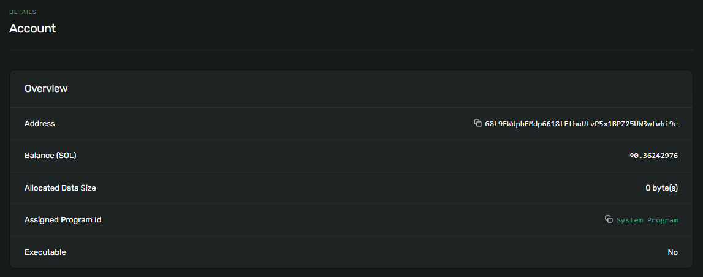
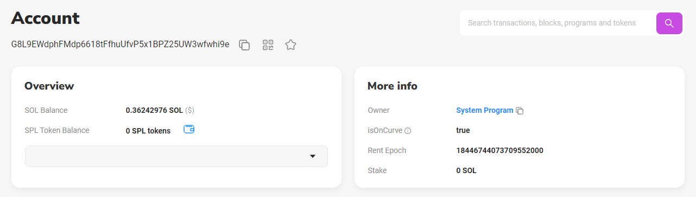

# Solana账户模型

Solana的账户模型与以太坊不同，在介绍之前，先回顾一下以太坊的账户模型。

---
### 以太坊账户模型

以太坊有两种账户类型：外部账户（Externally Owned Accounts，EOA）和合约账户（Contract Accounts，CA）。

- 外部账户：由私钥控制，不包含任何EVM（以太坊虚拟机）代码。
- 合约账户：包含智能合约的代码和状态。它们不由私钥控制，而是由其合约代码和与之相关的交易决定其行为。

以太坊账户数据结构：

|数据名称|数据说明|外部账户|合约账户|
|---|---|---|---|
|nonce|账户计数器|✔|✔|
|balance|账户余额|✔|✔|
|codeHash|代码哈希|❌|✔|
|storageRoot|状态树根哈希|❌|✔|

在以太坊的合约账户中，存储了智能合约的代码和状态。

---
### Solana账户模型

Solana也有两种账户类型：程序账户和数据账户。

- 程序账户：又叫可执行账户，存储程序字节码，不可修改。
  - 原生程序账户（系统程序）
  - 用户程序账户（SPL程序）
- 数据账户：又叫非执行账户，存储状态数据，只有账户所有者可修改。
  - 系统所有账户
  - 程序派生账户（PDA）

Solana账户数据结构：
|数据名称|数据说明|程序账户|数据账户|
|---|---|---|---|
|lamports|账户余额|✔|✔|
|owner|	账户所有者|系统程序|关联的程序|
|executable|是否可执行|true|false|
|data|存储的数据|程序字节码|状态数据|
|rent_epoch|租期|✔|✔|

关于账户所有者：
- 只有账户所有者才能修改存储的数据，其他账户只能读数据。
- 只有账户所有者才能提取lamports，其他账户只能存入lamports。
- 账户所有者可以指定新的所有者，或清除该数据以使程序不可变。


---
### Solana账户 VS 以太坊账户 

|对比维度|以太坊|Solana||
|---|---|---|---|
|原生代币|ETH|SOL|
|最小单位|Wei|Lamports|
|换算公式|1 ETH = 10^18 Wei|1 SOL = 10^9 Lamports|
|存储位置|代码和状态存储在<br>同一账户（合约账户）|代码和状态存储在不同账户<br>代码存储在程序账户<br>状态存储在数据账户|
|代币标准|ERC20 Token|SPL Token|
|链上代码|智能合约|程序|
||||

---
### 程序派生账户（PDA）

---
### 账户案例演示

#### 钱包账户（部署者账户）

以刚创建的钱包账户为例进行演示：`G8L9EWdphFMdp6618tFfhuUfvP5x1BPZ25UW3wfwhi9e`

在区块浏览器上查看账户属性: 

- `Executable` 字段值为NO。钱包账户可以理解为一个特殊的数据账户，主要用于管理资金和签名交易。
- `Owner` 字段值为System Program。

```
https://explorer.solana.com/address/G8L9EWdphFMdp6618tFfhuUfvP5x1BPZ25UW3wfwhi9e?cluster=testnet
```

```  
https://solscan.io/account/G8L9EWdphFMdp6618tFfhuUfvP5x1BPZ25UW3wfwhi9e?cluster=testnet
```


### 程序账户 

以刚部署的程序为例进行演示：`ECToMXPsqKV9b6tYiFTwkZcX7y6dwuLXkPyGhbUwH8S`

在区块浏览器上查看账户属性: 

- `Executable` 字段值为Yes，说明这是一个程序账户。
- `Owner` 字段值为BPF Upgradeable Loader。
- `Upgradeable` 字段为Yes，升级权限所有者是部署程序的账户。

```
https://explorer.solana.com/address/ECToMXPsqKV9b6tYiFTwkZcX7y6dwuLXkPyGhbUwH8S?cluster=testnet
```

```
https://solscan.io/account/ECToMXPsqKV9b6tYiFTwkZcX7y6dwuLXkPyGhbUwH8S?cluster=testnet
```


### 程序可执行数据账户

区块浏览器中显示了另一个账户：`HFkZ51imH5YFEYAoJs9efdD8AG8qsPHka4FSErBXg7Nm` ，叫程序可执行数据账户。

该账户存储链上程序的可执行字节码。当程序升级时，该帐户的数据将使用新的字节码进行更新。

程序账户和程序可执行数据账户可以当做一个整体来看，程序账户作为程序的代理，而程序的字节码存储在程序可执行数据账户中。

在区块浏览器上查看账户属性: 

- `Executable` 字段值为No，这个账户用于存储程序字节码，账户本身不可执行。
- `Owner` 字段值为BPF Upgradeable Loader。
- `Upgradeable` 字段为Yes，升级权限所有者是部署程序的账户。

```
https://explorer.solana.com/address/HFkZ51imH5YFEYAoJs9efdD8AG8qsPHka4FSErBXg7Nm?cluster=testnet
```

```
https://solscan.io/account/HFkZ51imH5YFEYAoJs9efdD8AG8qsPHka4FSErBXg7Nm?cluster=testnet
```


TODO:
程序部署流程。
程序升级流程。（程序账户和程序可执行数据账户如何变化）