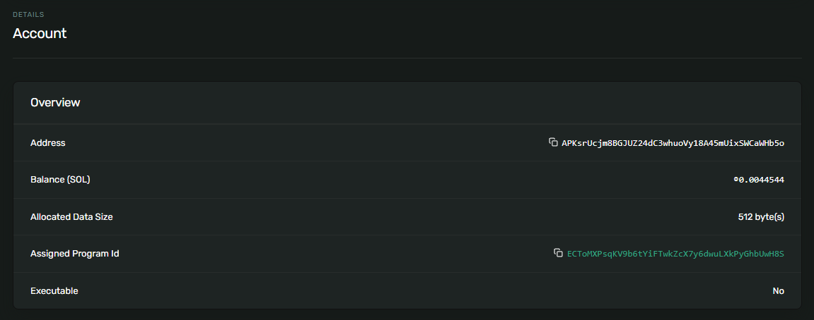

# Solana账户模型

Solana的账户模型与以太坊不同，在介绍之前，先回顾一下以太坊的账户模型。

---
### 以太坊账户模型

以太坊有两种账户类型：外部账户（Externally Owned Accounts，EOA）和合约账户（Contract Accounts，CA）。

- 外部账户：由私钥控制，不包含任何EVM（以太坊虚拟机）代码。
- 合约账户：包含智能合约的代码和状态。它们不由私钥控制，而是由其合约代码和与之相关的交易决定其行为。

以太坊账户数据结构：

|数据名称|数据说明|外部账户|合约账户|
|---|---|---|---|
|nonce|账户计数器|✔|✔|
|balance|账户余额|✔|✔|
|codeHash|代码哈希|❌|✔|
|storageRoot|状态树根哈希|❌|✔|

在以太坊的合约账户中，存储了智能合约的代码和状态。

---
### Solana账户模型

Solana也有两种账户类型：程序账户和数据账户。

- 程序账户：又叫可执行账户，存储程序字节码，不可修改。
  - 原生程序账户（系统程序）
  - 用户程序账户（SPL程序）
- 数据账户：又叫非执行账户，存储状态数据，只有账户所有者可修改。
  - 系统所有账户
  - 程序派生账户（PDA）

Solana账户数据结构：
|数据名称|数据说明|程序账户|数据账户|
|---|---|---|---|
|lamports|账户余额|✔|✔|
|owner|	账户所有者|系统程序|关联的程序|
|executable|是否可执行|true|false|
|data|存储的数据|程序字节码|状态数据|
|rent_epoch|租期|✔|✔|

关于账户所有者：
- 只有账户所有者才能修改存储的数据，其他账户只能读数据。
- 只有账户所有者才能提取lamports，其他账户只能存入lamports。
- 账户所有者可以指定新的所有者，或清除该数据以使程序不可变。


---
### Solana账户 VS 以太坊账户 

|对比维度|以太坊|Solana||
|---|---|---|---|
|原生代币|ETH|SOL|
|最小单位|Wei|Lamports|
|换算公式|1 ETH = 10^18 Wei|1 SOL = 10^9 Lamports|
|存储位置|代码和状态存储在<br>同一账户（合约账户）|代码和状态存储在不同账户<br>代码存储在程序账户<br>状态存储在数据账户|
|代币标准|ERC20 Token|SPL Token|
|链上代码|智能合约|程序|
||||

---
### 程序派生账户（PDA）
在Solana账户模型中，程序和数据分别存储在不同的账户中，程序存储在程序账户，数据存储在数据账户。

用户与程序交互时，需要传入数据账户，用于存储或者修改用户数据，并且每个程序都需要一个对应的数据账户。此时用户必须拥有数据账户的私钥，才能修改用户数据。

这就带来一个问题：用户如何管理这些数据账户的私钥？程序派生账户（PDA）解决了这个问题。

程序派生账户生成方式为（伪代码）：pda = hash(program_id, seeds, bump);
- program_id：程序账户地址。
- seeds：种子，可以是任意字符串，一般在种子中包含用户地址。
- bump：0~255之间的扰动值，用于生产无私钥的PDA账户。

程序派生账户生成原理：使用program_id 和 seeds 计算哈希函数时，会有50%的概率得到一个落在ED2559椭圆曲线上的有效公钥，此时需要在数据中加入扰动，一开始指定bump=255，逐步递减尝试，比如254->253->252等等，直到获取一个不落在ED2559椭圆曲线上的公钥。

这样产生的PDA账户的好处是：
- 没有私钥，完全由程序来控制。
- 将程序和用户关联了起来，可以供程序来存储指定用户的数据。

> 说明：当一个公钥位于椭圆曲线上时，则存在一个对应的私钥，可以使私钥加密算法生效。反之则不存在私钥。

---
### 代币账户（Mint Account，SPL Token Account）
Solana中，一个代币，仅仅是一个归Token合约管理的普通的Account对象。

代币账户中，包含了代币的基本信息，如：supply总供应量、decimals代币精度。


---
### 用户代币账户（Associated Token Account, ATA）

用户代币账户存放了每个用户拥有的代币数量信息。


---
### 账户案例演示

#### 钱包账户（部署者账户）

以刚创建的钱包账户为例进行演示：`G8L9EWdphFMdp6618tFfhuUfvP5x1BPZ25UW3wfwhi9e`

在区块浏览器上查看账户属性: 

- `Executable` 字段值为NO。钱包账户是数据账户的一种，主要用于管理资金和签名交易。
- `Owner` 字段值为System Program。

https://explorer.solana.com/address/G8L9EWdphFMdp6618tFfhuUfvP5x1BPZ25UW3wfwhi9e?cluster=testnet


https://solscan.io/account/G8L9EWdphFMdp6618tFfhuUfvP5x1BPZ25UW3wfwhi9e?cluster=testnet


### 程序账户 

以刚部署的程序为例进行演示：`ECToMXPsqKV9b6tYiFTwkZcX7y6dwuLXkPyGhbUwH8S`

在区块浏览器上查看账户属性: 

- `Executable` 字段值为Yes，说明这是一个程序账户。
- `Owner` 字段值为BPF Upgradeable Loader。
- `Upgradeable` 字段为Yes，升级权限所有者是部署程序的账户。

https://explorer.solana.com/address/ECToMXPsqKV9b6tYiFTwkZcX7y6dwuLXkPyGhbUwH8S?cluster=testnet


https://solscan.io/account/ECToMXPsqKV9b6tYiFTwkZcX7y6dwuLXkPyGhbUwH8S?cluster=testnet


### 程序可执行数据账户

区块浏览器中显示了另一个账户：`HFkZ51imH5YFEYAoJs9efdD8AG8qsPHka4FSErBXg7Nm` ，叫程序可执行数据账户。

该账户存储链上程序的可执行字节码。当程序升级时，该帐户的数据将使用新的字节码进行更新。

程序账户和程序可执行数据账户可以当做一个整体来看，程序账户作为程序的代理，而程序的字节码存储在程序可执行数据账户中。

在区块浏览器上查看账户属性: 

- `Executable` 字段值为No，这个账户用于存储程序字节码，账户本身不可执行。
- `Owner` 字段值为BPF Upgradeable Loader。
- `Upgradeable` 字段为Yes，升级权限所有者是部署程序的账户。

https://explorer.solana.com/address/HFkZ51imH5YFEYAoJs9efdD8AG8qsPHka4FSErBXg7Nm?cluster=testnet


https://solscan.io/account/HFkZ51imH5YFEYAoJs9efdD8AG8qsPHka4FSErBXg7Nm?cluster=testnet


### 数据账户

常见的数据账户有两种：用户创建的数据账户 和 程序创建的数据账户（PDA）。

#### 用户创建的数据账户

- 用户钱包数据账户
  
  前面介绍的，使用`solana-keygen new`创建的钱包账户，属于用户创建的数据账户，用来管理资金和签名交易。

- 程序状态数据账户
  
  用户与程序进行交互的时候，需要创建一个数据账户来存储状态数据或用户数据。这类数据账户通常在程序部署时或程序交互时创建。账户的所有权通常设置为对应的程序账户地址，这样只有该程序才能写入或修改数据。

  下面演示如何创建一个程序状态数据账户，对应的程序账户，是前面部署的官方演示HelloWorld程序。

  ```shell
  > ts-node script/create_data_account.ts

    数据账户:  PublicKey [PublicKey(APKsrUcjm8BGJUZ24dC3whuoVy18A45mUixSWCaWHb5o)] {
    _bn: <BN: 8b714dde7b604535000d4a513a15fdb707928046685a058ebccee52f3e35c70e>
    }
    钱包账户:  PublicKey [PublicKey(G8L9EWdphFMdp6618tFfhuUfvP5x1BPZ25UW3wfwhi9e)] {
    _bn: <BN: e0c0036fff73beb0b3b41a12e80ada1bdddca947153e60b0a96ebfaea4df2399>
    }

    Transaction successful with signature: 4pFgtctDhbNeYDDzb1a5DF3JtTstZ4DxRNsbyjKtf2y4JchHSCc2cj7Dfd4NiMwc5uq8edvzqGRy4XkWm3Kr7CWe
  ```

  构造的交易中，包含3个账户信息。
  - 钱包账户：G8L9EWdphFMdp6618tFfhuUfvP5x1BPZ25UW3wfwhi9e
  - 程序账户：ECToMXPsqKV9b6tYiFTwkZcX7y6dwuLXkPyGhbUwH8S
  - 数据账户：APKsrUcjm8BGJUZ24dC3whuoVy18A45mUixSWCaWHb5o

  交易完成后，可在区块浏览器查看数据账户属性。

  - `Executable` 字段值为No，这个账户用于存储程序状态，账户不可执行。
  - `Allocated Data Size` 字段值为512 bytes，这是交易中设置的存储空间。
  - `Owner` 字段值为程序账户：ECToMXPsqKV9b6tYiFTwkZcX7y6dwuLXkPyGhbUwH8S。

  https://explorer.solana.com/address/APKsrUcjm8BGJUZ24dC3whuoVy18A45mUixSWCaWHb5o?cluster=testnet
  

  https://solscan.io/account/APKsrUcjm8BGJUZ24dC3whuoVy18A45mUixSWCaWHb5o?cluster=testnet
  

#### 程序创建的数据账户（PDA）

在某些场景下，程序可能会为用户创建一个或多个程序派生账户（PDA）。PDA账户是由程序根据特定的种子信息和程序公钥派生出的地址，不需要私钥。PDA账户可代表程序持有代币。

程序部署流程。
程序升级流程。（程序账户和程序可执行数据账户如何变化）